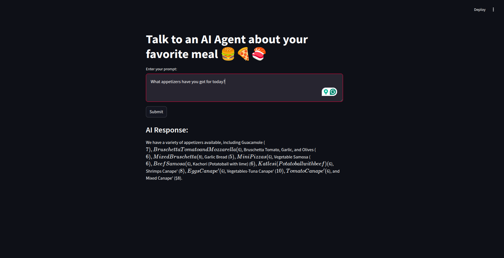
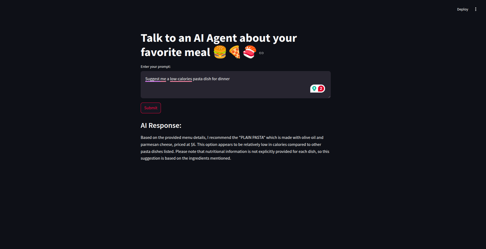

# RAGGING_Restaurant_Menu_AI_Agent

The RAGGING Restaurant Menu AI Agent is a sophisticated system designed to enhance customer interactions with restaurant menus provided in PDF format. By leveraging advanced Retrieval-Augmented Generation (RAG) techniques, this agent delivers accurate and contextually relevant responses to user inquiries about menu items, ingredients, and dietary information. The application is implemented as a web-based interface using Streamlit, facilitating seamless user engagement.​


WebApp Samples:




## Features

1. Local Deployment with Ollama: Ensures data privacy by allowing the agent to operate entirely on local infrastructure. Cloud deployment options are also available for scalability.
2. Multi-Query RAG: Enhances the retrieval process by generating multiple queries from a single user prompt, improving the accuracy and relevance of the information retrieved.​
3. FAISS Vector Database Integration: Utilizes Meta's FAISS library to efficiently index and retrieve document embeddings, facilitating rapid and precise information retrieval.
4. Customizable Language Models: Employs the Llama model by default, with the flexibility to integrate various foundational models as per user requirements.​
5. Streamlit Web Application: Provides an intuitive and interactive web interface for users to engage with the AI agent seamlessly.​
6. LangChain Integration: Incorporates LangChain to manage complex interactions between language models and data sources, enhancing the agent's reasoning capabilities.

## Understanding RAG and Multi-Query RAG

Retrieval-Augmented Generation (RAG) is a framework that combines the strengths of retrieval-based and generative models. It enhances the response quality of language models by retrieving relevant documents from external knowledge bases and incorporating this  information into the generation process. This approach mitigates issues like outdated or incorrect information by grounding responses in real-time, pertinent data.

Multi-Query RAG extends the traditional RAG framework by generating multiple queries from a single user prompt. This technique addresses the challenges posed by ambiguous or complex queries, ensuring a comprehensive retrieval of relevant information. By refining and decomposing the initial query into several targeted sub-queries, the system can retrieve a broader and more accurate set of documents, leading to improved response generation.

## How to Run the Application

To execute the application using the provided sample restaurant menu PDF with default parameters:

```bash
./run.sh
```
To use a custom menu, specify the path to your restaurant's menu PDF in the `run.sh` script:

```bash
# Menu PDF Path
PDF_PATH="<PATH_TO_YOUR_RESTAURANT_CUSTOM_MENU>.pdf"
```
